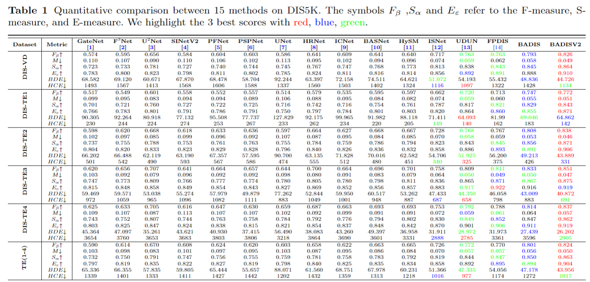

# Boundary-Aware-Dichotomous-Image-Segmentation(v2)
## Introduction
This repo is the official implementation of "Boundary-Aware Dichotomous Image Segmentation". It currently includes code and models for the Dichotomous-Image-Segmentation task.
## Experiment

## Usage
### Requirements
* Pytorch 1.13.1
* OpenCV
* Numpy
* Apex
* Timm
### How to start
creat Folder `model`,`pre`,`src`
### Directory

````
.
|-- README.md
|-- model
|   |-- model-56.pth
|-- pre
|   |-- resnet18.pth
|   `-- swin224.pth
|-- result
`|`-- src
    |-- BADIS.py
    |-- Res.py
    |-- ResNet_models_Custom.py
    |-- Swin.py
    |-- __pycache__
    |   |-- Res.cpython-310.pyc
    |   |-- ResNet_models_Custom.cpython-310.pyc
    |   `-- Swin.cpython-310.pyc
    |-- dataset.py
    |-- edge_prediction.py
    |-- test.py
    |-- test.sh
    |-- train.py
    |-- train.sh
    `-- utils
        |-- __init__.py
        `-- lr_scheduler.py
````

### Train
For train, download the requried weight [swin224.pth](https://drive.google.com/file/d/1rH37swroDKhKYNDtmQPXvxilZgdi6Qap/view?usp=sharing),[resnet18.pth](https://drive.google.com/file/d/1hNk19P6HTFWaiCQFQuru0SXYiSP4rtFJ/view?usp=drive_link)
```
cd src
./train.sh
```

### Test
For train, download the requried weight [model-56.pth](https://drive.google.com/file/d/1PmJkQot8RoZcWOl1JmCaiTs6eESCrhBM/view?usp=drive_link)
```
cd src
./test.sh
```

## Citation
```
@article{tang2024boundary,
  title={Boundary-aware dichotomous image segmentation},
  author={Tang, Haonan and Chen, Shuhan and Liu, Yang and Wang, Shiyu and Chen, Zeyu and Hu, Xuelong},
  journal={The Visual Computer},
  pages={1--12},
  year={2024},
  publisher={Springer}
}
```
